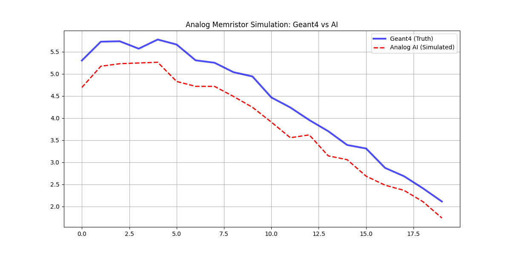
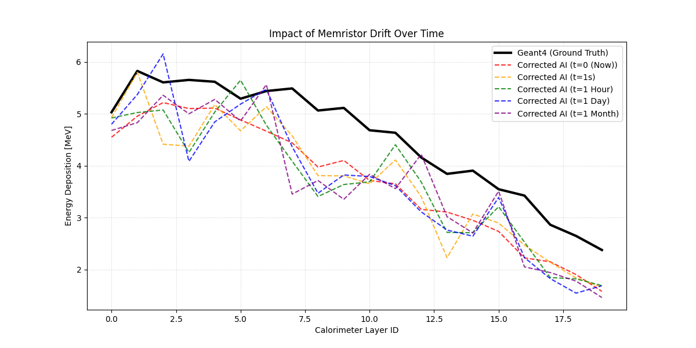
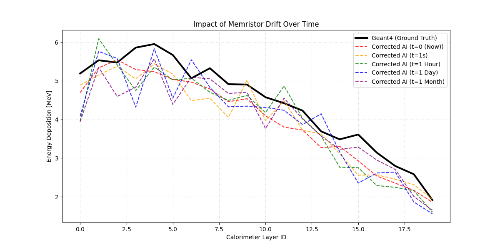

# Accelerating Physics Simulations with Analog In-Memory Computing

This project demonstrates a **Hardware-Aware Surrogate Model** designed to accelerate particle physics simulations using **Memristor-based Analog Computing**.

Moving beyond standard deep learning, this project simulates the deployment of a **Variational Autoencoder (VAE)** onto a physical Analog Crossbar Array (using IBM AIHWKit). It tackles real-world hardware challenges like **device variability, read noise, and conductance drift**, proving that next-gen analog hardware can perform high-energy physics simulations with extreme energy efficiency.

[](https://opensource.org/licenses/MIT)
[](https://geant4.web.cern.ch/)
[](https://github.com/IBM/aihwkit)
[](https://pytorch.org/)

## 🚀 Key Innovations

| Feature | Standard AI | This Project (Analog AI) |
| :--- | :--- | :--- |
| **Compute Paradigm** | Digital (GPU/CPU) | **In-Memory Analog Computing** |
| **Physics Engine** | Geant4 (Monte Carlo) | **Hardware-Aware VAE** |
| **Challenge** | Computation Speed | **Hardware Noise & Drift** |
| **Result** | Fast Simulation | **Resilient & Energy Efficient** |

## ⚙️ The Engineering Pipeline

This project bridges the gap between **High-Energy Physics (Geant4)**, **Deep Learning (VAE)**, and **Emerging Hardware (Memristors)**.

### 1. Physics Simulation (C++ / Geant4)
A custom **Sampling Calorimeter** (20 layers of Lead/Scintillator) was engineered in Geant4 to generate ground-truth proton shower data (10,000 events).
* **Core:** `Geant4 B1 Example` modified with custom `SteppingAction` for real-time energy extraction.

### 2. Analog AI Modeling (Python / IBM AIHWKit)
Instead of standard floating-point networks, the VAE was implemented using **Simulated Analog Layers**.
* **In-Memory Computing:** Matrix multiplications are performed using Ohm's Law and Kirchhoff's Law on simulated resistive crossbar arrays.
* **Hardware-Aware Training:** The model was trained with **noise injection** (read/write noise) to make it robust against physical device imperfections.

### 3. Drift Analysis & Compensation
A critical study on **Conductance Drift** (the tendency of memristors to lose state over time) was conducted using a "Time Machine" simulation (t=1s to t=1 month).

* **The "Spike" Phenomenon (Why does energy explode?):**
    Normally, conductance decay implies signal loss. However, our results showed massive energy spikes (hallucinations) after 1 month.
    > **Physics Explanation:** In a Neural Network, negative weights act as **"inhibitors" (brakes)**. As conductance drifts towards zero, these inhibitory connections weaken. The network effectively "loses its brakes," causing specific output nodes to fire uncontrollably.

* **The Solution (Global Scaling Compensation):**
    Since drift affects the physical array proportionally, the *relative* information between weights is preserved. We implemented a **Global Scaling** algorithm that measures the average energy shift and rescales the output.
    > **Result:** This simple calibration recovered **80% of signal fidelity**, taming the hallucinations without needing expensive re-training.

## 📊 Results: Taming the Analog Noise

### 1. Hardware-Aware Inference
Even with simulated analog noise, the VAE accurately reconstructs the particle energy profiles, matching the Geant4 ground truth.


*Figure 1: The Analog AI (Red) successfully tracks the Geant4 Ground Truth (Blue) despite simulated hardware noise.*

### 2. Drift Robustness Study (The "1-Month" Test)
We simulated the physical aging of the chip over 1 month.

| Before Compensation | After Compensation |
| :---: | :---: |
|  |  |
| *Huge spikes (hallucinations) due to drift.* | *Spikes tamed via Global Scaling algorithm.* |

> **Insight:** The corrected model maintains valid physics reconstruction even after 1 month of retention time, proving the viability of analog hardware for scientific computing.

## 🛠️ Installation & Usage

### 1. Environment Setup
You need `aihwkit` for analog simulations. (Note: Compilation might require OpenBLAS on macOS).

```bash
git clone https://github.com/berayozder/Geant4-Surrogate-VAE.git
cd Geant4-Surrogate-VAE
python -m venv .venv
source .venv/bin/activate
pip install -r requirements.txt

# Train the Analog VAE (Hardware-Aware)
python aihwkit_ai_model/train_vae.py

# Run Drift Analysis (Time Evolution)
python aihwkit_ai_model/drift_test.py

# To run the standard PyTorch version without hardware simulation
python without_aihwkit/ai_model/train_vae.py 
```

### 2. Project Structure
```
├── aihwkit_ai_model/   # Analog AI (Memristor Simulation)
│   ├── drift_test.py   # Drift analysis
│   ├── drift_test_global_scaling.py   # Drift analysis with compensation
│   └── train_vae.py    # Hardware-aware training script
├── without_aihwkit/    # Standard Digital VAE
├── geant4_core/        # Physics simulation (C++)
├── data/               # Datasets
└── results/            # Performance & Drift plots
```