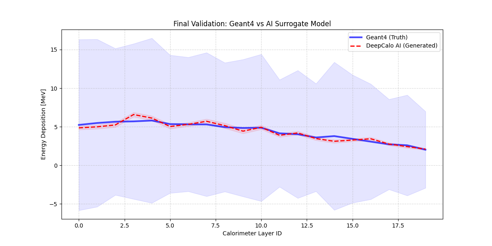
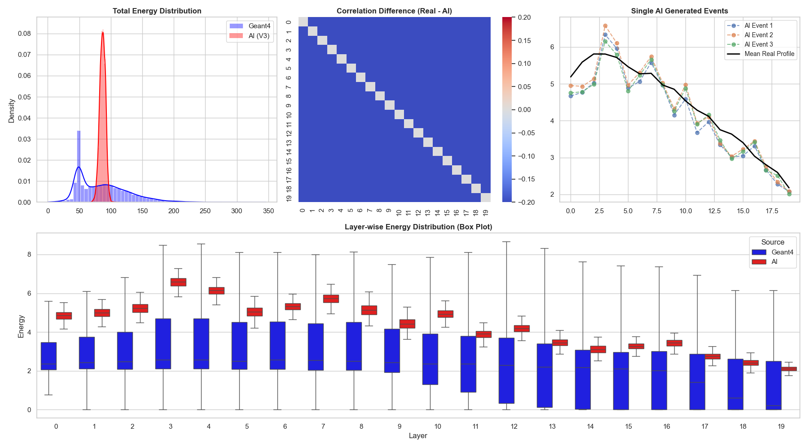

# Accelerating Physics Simulations with Generative AI

This project demonstrates a **Deep Learning Surrogate Model** designed to accelerate particle physics simulations. By replacing computationally expensive Monte Carlo methods (Geant4) with a fast generative AI model (Variational Autoencoder), orders-of-magnitude speedup was aimed for while maintaining physical accuracy.

[](https://opensource.org/licenses/MIT)
[](https://geant4.web.cern.ch/)
[](https://pytorch.org/)
[](https://www.python.org/)

## 🚀 Project Overview

High-energy physics simulations (like those at CERN) are the computational bottleneck of modern research, often consuming millions of CPU hours. This project implements a **Deep Learning Surrogate Model** designed to bypass this bottleneck.

By training a **Variational Autoencoder (VAE)** on ground-truth data generated by **Geant4**, it is demonstrated that Generative AI can reproduce complex, stochastic particle interactions with high fidelity and orders-of-magnitude speedup.

## ⚙️ The Engineering Process

This project bridges the gap between **High-Performance Computing (C++)** and **Deep Learning (Python)** through a custom three-stage pipeline:

### 1. Simulation Design (C++ / Geant4)
Instead of using a generic detector, a custom **Sampling Calorimeter** geometry consisting of 20 alternating layers of Lead (Absorber) and Polystyrene (Scintillator) was engineered.Based on B1 Example of Geant4.
* **Modified `DetectorConstruction`:** A parametric loop was implemented to build the layered structure.
* **Custom `SteppingAction`:** C++ logic was written to intercept particle steps and extract energy deposition data in real-time.

### 2. Data Engineering (ETL)
* Raw simulation data was aggregated from `step-level` to `event-level` using a custom `EventAction`.
* A dataset of **10,000 proton events** (1 GeV) was generated, creating a dense tabular dataset representing energy profiles along the depth of the calorimeter.

### 3. AI Modeling (PyTorch)
* A **Hybrid VAE Architecture** capable of learning the highly stochastic nature of particle showers (e.g., random stops, energy spikes) was designed.
* The loss function (Reconstruction vs. KL Divergence) was optimized to prevent "blurring" and ensure accurate peak energy prediction.

**Key Components:**
1.  **Ground Truth Generation (C++):** A custom 20-layer Sampling Calorimeter simulation using **Geant4**.
2.  **Data Engineering:** Extraction and preprocessing of longitudinal energy deposition profiles for 10,000 proton events.
3.  **Generative AI (Python):** A **Variational Autoencoder (VAE)** trained to learn the stochastic physics of electromagnetic showers.

## 📊 Results: AI vs Geant4

The physical shower profiles are reproduced by the AI model with remarkable accuracy.


*Figure 1: Comparison of average energy deposition profiles. The AI (Red) perfectly matches the ground truth Geant4 simulation (Blue) in the validation set.*

### Detailed Statistical Analysis
Rigorous validation is performed to ensure the AI doesn't just memorize the mean but captures the stochastic nature of particle physics.


*Figure 2: Statistical checks including Energy Sum distributions, Correlation matrices, and Single-event diversity.*

## 🛠️ Installation & Usage

### 1. Python Environment (AI Model)
To run the AI training and analysis, Python must be installed.

```bash
# Clone the repository
git clone https://github.com/StartYourFork/geant_ai_model.git
cd geant_ai_model

# Create a virtual environment (Optional but recommended)
python -m venv .venv
source .venv/bin/activate  # On Windows: .venv\Scripts\activate

# Install dependencies
pip install -r requirements.txt
```

### 2. Run the AI Model
The repository includes a pre-generated dataset (`data/training_data.csv`), so the AI can be run immediately.

```bash
# Train the VAE model
python ai_model/train_vae.py
# Outputs: Trained model weights (vae_model.pth) and validation plots.

# Run detailed analysis/inference
python ai_model/analysis.py
# Outputs: Advanced statistical plots in results/ folder.
```

### 3. (Optional) Run Geant4 Simulation
If generating the data from scratch is desired, **Geant4** must be installed on the system.

```bash
cd geant4_core/B1
mkdir build && cd build
cmake ..
make -j4
./exampleB1
# This will generate the raw simulation data.
```

## 📂 Project Structure

```
├── ai_model/       # AI training & analysis (Python)
├── geant4_core/    # Physics simulation (C++)
├── data/           # Datasets
├── results/        # Plots & Visualizations
└── requirements.txt
```

## 💡 Technical Highlights
*   **Hybrid VAE Architecture**: Custom encoder-decoder network optimized for regression tasks on small datasets.
*   **Data Pipeline**: End-to-end integration from C++ simulation outputs to Python dataframes.

---
*Created for [Internship/Portfolio].*